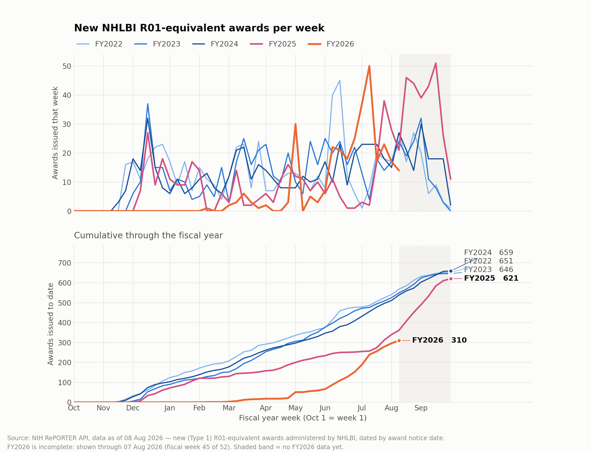

# NIH award tracker

Tracks **new (Type 1) NIH awards by week**, refreshed daily from the
[RePORTER API](https://api.reporter.nih.gov/) and corrected for RePORTER's reporting lag.

**→ [Live dashboard](https://08wparker.github.io/nih-award-tracker/)**

Pick an institute and an award family to see FY2022–26 weekly awards, plus a comparison
of every agency's FY2026 pace against its own recent history. A static PNG of the
original NHLBI R01-equivalent question is also produced for slides.



## Why the lag correction exists

RePORTER publishes an award days to months after its notice date. The most recent weeks
of any chart are therefore always undercounted, and read as a collapse in funding that
has not happened. The effect is large and differs sharply by award family:

| Award family | visible within 7d | 28d | 56d | 180d | median lag |
|---|---|---|---|---|---|
| R01-equivalents | 81% | 98% | >99% | >99% | 5 d |
| K-series | 77% | 97% | 99% | >99% | 8 d |
| F-series | 9% | 40% | 60% | 97% | 46 d |
| F32 | 4% | 30% | 49% | 97% | 58 d |

This is measurable at all only because each record carries a **`date_added`** ingestion
timestamp, so the delay distribution can be recovered from a single pull rather than by
accumulating snapshots for months.

**Fellowships cannot be made current by any amount of refreshing.** An F32 is typically
only half-published two months after its notice date. The dashboard masks those weeks
rather than drawing a line through them.

## How the correction works

A **chain ladder** on the reporting triangle of recent cohorts. For each development
step it pools the cohorts old enough to have been observed at both ends and takes the
ratio of cumulative counts; the product of the remaining factors converts a partial
count into an estimated ultimate. Recent cohorts dominate the early factors, so the
estimate tracks the present regime rather than assuming last year's.

Each week's count is divided by the share of that week expected to be visible by now.
Weeks below 20% expected completeness are dropped rather than guessed at.

### Backtest

`date_added` also makes honest validation possible: rewind the store to a past date,
refit the curves on data available *then* (no look-ahead), nowcast, and score against
what actually materialised. Across 213 partially-reported weeks at horizons of 14–180
days:

| completeness at the time | raw error | corrected error | corrected bias |
|---|---|---|---|
| 20–40% | 72% | **34%** | 0.92 |
| 40–60% | 68% | **38%** | 0.90 |
| 60–80% | 39% | **25%** | 0.97 |
| 80–90% | 16% | **10%** | 0.98 |
| 90–98% | 5.6% | **3.7%** | 1.00 |

Overall 95% interval coverage: **96%**. The interval combines Poisson noise in the count
with the bootstrap spread of the completeness curve; with Poisson noise alone coverage
was only 80–84% in the least-complete weeks.

Reproduce with `python3 scripts/backtest.py`.

## Layout

```
reporter/          library
  api.py           paced RePORTER client (pagination + hard-limit guards)
  families.py      activity-code groups
  store.py         award-level upsert keyed on appl_id
  fiscal.py        federal fiscal-week calendar
  lag.py           completeness curve + nowcast
  aggregate.py     weekly series -> docs/data.json
scripts/
  bootstrap.py     one-time full history pull
  refresh.py       daily delta (--reconcile for a full refetch)
  build_dashboard.py
  backtest.py
  serve.py         local preview of docs/
docs/              GitHub Pages dashboard (no build step, no CDN)
data/awards.csv.gz award-level store, ~40k rows
tests/
```

## Usage

```bash
pip install -r requirements.txt
python3 scripts/bootstrap.py          # once: ~90 requests, ~2 min
python3 scripts/refresh.py            # daily: ~3 requests, seconds
python3 scripts/build_dashboard.py
python3 scripts/serve.py              # http://127.0.0.1:8777
```

GitHub Actions runs the refresh daily and deploys the dashboard to Pages. It reconciles
in full on Sundays, to catch records RePORTER revised without changing `date_added`.

## API constraints (verified against the live API)

| Constraint | Value |
|---|---|
| `limit` | max 500 |
| `offset` | max 14,999 — a hard 15,000-record ceiling per query |
| Rate limit | ~1 req/s; 1.2 s pacing is stable |
| Auth | none required |

All-NIH Type-1 for one fiscal year is 15,401 records, already over the ceiling, so
queries are partitioned by award family. `api.py` raises `ResultSetTooLarge` rather than
returning a silently truncated page.

Useful filters, all confirmed working: `fiscal_years`, `activity_codes`, `agencies`,
`award_types`, `award_notice_date`, and `date_added` (which makes the daily delta cheap).

## Data definitions

* **New awards** are Type 1 only — brand-new projects, not Type 2 competing renewals.
* **R01-equivalents** follow RePORTER's own grouping: R01, R37, RF1, RL1, U01, DP1, DP2,
  DP5, R35, RM1. **R56 is excluded** — RePORTER leaves these bridge awards out, and
  including them overstated NHLBI by 138 awards across FY2022–25. R56 is still fetched
  and stored, just not reported as an R01-equivalent.
* Awards are attributed to their **administering IC** and dated by **award notice date**.
* Non-NIH HHS agencies that RePORTER covers (AHRQ, FDA, NIOSH, NCIPC) are included.

`tests/test_parity.py` pins the R01-equivalent definition against a frozen RePORTER web
export: for NHLBI it reproduces every closed fiscal year exactly (FY2022 651, FY2023 646,
FY2024 659, FY2025 621).

## Tests

```bash
python3 tests/test_fiscal.py      # fiscal-week binning
python3 tests/test_parity.py      # export parity, upsert idempotency, API guards
node tests/test_dashboard.js      # headless render (needs jsdom on NODE_PATH)
```
